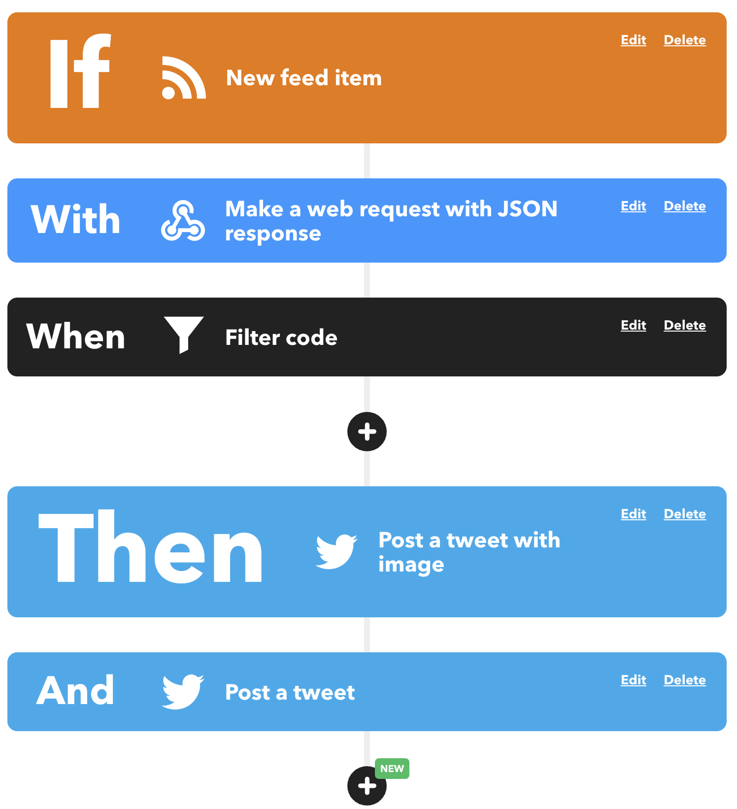

## Mastodon To Twitter with Images (IFTTT Applet)

This is source code of ```mas2twimg``` API to help you automatically re-publish/sync Mastodon toot to Twitter with IFTTT Applet(with query and filter).

- This service will not save your data or access your IFTTT account.
- Online API(fair use): [https://api.iedon.com/misc/mas2twimg/getTootImages](https://api.iedon.com/misc/mas2twimg/getTootImages)

## Screenshot of Applet



## Usage

- Make sure you have purchased ```IFTTT Pro+```

- Configure a Mastodon RSS trigger and then create a query with Webhook

- Type URL: ```https://api.iedon.com/misc/mas2twimg/getTootImages``` , method: ```POST``` , content type: ```application/json``` , body: ```{ "EntryUrl": "{{EntryUrl}}" }```

- Save the query and add a filter with the following code, save and create IFTTT THEN action with a "Post a tweet(Tweet text: ```{{EntryContent}}``` )" and a "Post a tweet with image(Tweet text: ```{{EntryContent}}``` , Image URL: ```{{EntryImageUrl}}``` )"

## Filter code

```js
// Tweet when toot.
// This filter code skips tweeting if 'nocrosspost' is present
// in the given content.
// Use postNewTweet() if the content does not include an image.
// Use postNewTweetWithImage() if does include.
// Note that only the first image in the content is cross-posted.
const content = Feed.newFeedItem.EntryContent;
let payload = JSON.parse(MakerWebhooks.makeWebRequestQueryJson[0].ResponseBody);

// Something error happened with server. Fallback to text only mode.
if (!payload.images || !Array.isArray(payload.images)) {
    Twitter.postNewTweet.skip('failed to fetch mas2twimg api');
    Twitter.postNewTweetWithImage.skip('failed to fetch mas2twimg api');
    payload = { stop: true, images: [] }
}

// If nocrosspost is found in the content, skip actions
if (content.toLowerCase().indexOf('_nocrosspost_') !== -1) {

  Twitter.postNewTweet.skip('user set no cross post');
  Twitter.postNewTweetWithImage.skip('user set no cross post');
  payload = { stop: true, images: [] }

} else if (!payload.stop) { // Then post
  
  if (payload.images.length === 0) {

    // No image -> use postNewTweet()
    Twitter.postNewTweetWithImage.skip('no image found in toot');

  } else {

    // With image -> use postNewTweetWithImage(), skip plain text
    Twitter.postNewTweet.skip('one or more image is given');
    
    // Set tweet content
    Twitter.postNewTweetWithImage.setTweet(content);

    // Currently only support one image sadly :(
    //@ts-ignore
    payload.images.forEach(img => Twitter.postNewTweetWithImage.setPhotoUrl(img))
  }

}
```